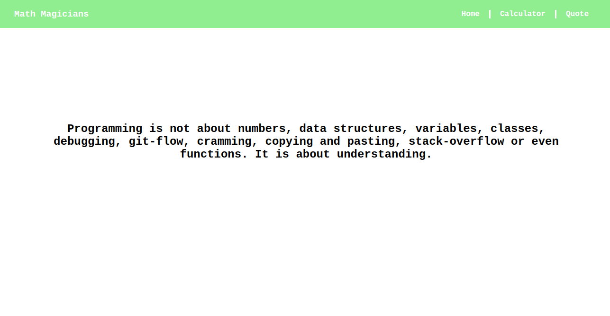

# Math Magicians

> One paragraph statement about the project.




A Web App that allows Math geeks to do simple calculations. Because they don't have calculators on their phones.
Users can also get motivational quotes regarding programming in the programming page. This is to keep them moving.

## Built With

- JSX, CSS
- React

## Live Demo

- Netlify: https://math-magicians-react.netlify.app/
- Heroku: https://math-magicians-js.herokuapp.com/


# Set Up
## Clone This Repository
```
$ git clone https://github.com/emmyobonyo/Math-Magiians-Raect.git
$ cd Math-Magiians-Raect
```

## Run Project
```
$ npm install
$ git checkout feature/components
$ npm start
```

👤 **Emmanuel Obonyo**

- GitHub: [@emmyobonyo](https://github.com/emmyobonyo)
- Twitter: [@emmyobonyo](https://twitter.com/emmyobonyo)
- LinkedIn: [Emmanuel Obonyo](https://www.linkedin.com/in/emmanuel-obonyo-3728a2200/)
## 🤝 Contributing

Contributions, issues, and feature requests are welcome!

Feel free to check the [issues page](https://github.com/emmyobonyo/Math-Magiians-Raect/issues).

## Show your support

Give a ⭐️ if you like this project!
